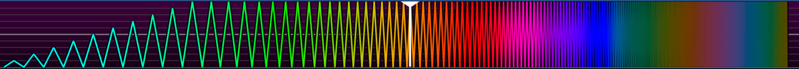

# OFS-SE - OpenFunscripter Sashimi Edition

[](https://www.gnu.org/licenses/gpl-3.0)

Creates `.funscript` files. (NSFW)

A fork of [OpenFunscripter](https://github.com/OpenFunscripter/OFS) 3.2,
which is no longer maintained. Everything below is new since 3.2. The
original is GPLv3, and [LICENSE](LICENSE) carries over to this fork unchanged.

Built on OpenGL, SDL2, ImGui, libmpv and the other libraries vendored under
[`lib/`](lib) - see [lib/VENDORED.md](lib/VENDORED.md) for the exact upstream
revision each one came from.


## What's new

### Scripting to music

- **Script to audio** - open an mp3, m4a, aac, ogg, opus, flac, wav, wma or
  aiff and script it against its waveform, which is drawn as soon as the file
  opens. The waveform also stays in sync when zooming and panning.
- **Tempo detection** - measures BPM per chapter, splits a mix into tracks
  where the music changes, finds the downbeat, and treats dotted or triplet
  readings as the same tempo. A chapter's tempo can be counted double or half
  time, or set by hand, and is kept when measuring again.
- **Tempo grid** - follows the chapter under the playhead, with points
  snapping to it when placed with the mouse.
- **Beat fill** - writes strokes along the beat across a chapter or a whole
  mix, either a plain stroke or a passage saved as a pattern and stamped at
  any tempo.
- **Depth from loudness** - scales the selected strokes by how loud the audio
  is under them, so a quiet verse is scripted shallower than the drop.
- **Beat ticks and a bass waveform** - marks where each hit lands, with the
  option to see only the low end, where the beat usually is.
- **Chapters** - mark a song's structure by hand or have it found, move a
  boundary from either side, and rename every chapter from where it falls and
  its tempo.

### Editing

- **Multi-lane timeline** - every loaded script gets its own lane, with a
  short name, a tick box to edit it alongside the active script, and an eye
  to hide it.
- **Selections** - drag a selection as one piece; extend, simplify and
  invert keep it selected; invert works on one or two points as well.
- **Right click menu** on the timeline with the edits that apply to the
  selection.
- **Multi-axis generator** - generate twist, roll and pitch from the
  selected stroke points, with a preview before applying.
- **Script check** - lists the strokes a device cannot follow, slows them
  down, and exports a copy within the limits you set.
- **No video needed** - start a script on a blank timeline of a chosen
  length.
- **Funscript 2.0 and 1.1** - full read and write support for the latest
  funscript formats.
- Fixes for points silently lost while dragging, and for Simplify carrying
  one selection's spacing into the next.

### Devices

- **OSR2 and SR6** over serial, wifi or Bluetooth, driving all six axes from
  their own scripts, with travel limits, a speed cap and an auto-home per axis.
- **Intiface Central** - plays the script on anything Intiface supports.

### 3D simulator

- A 3D model of a stroker, moved by every loaded axis at once: stroke,
  surge, sway, twist, roll and pitch, matching how a TCode machine moves.
- Cutaway view, turnable camera, fit to the video, and a toggle back to the
  2D bars.
- Axes are read from file names: `name.roll.funscript` is roll, and the
  script named after the video is the stroke. Video names with dots of their
  own, like `Site.com - clip.mp4`, work.

### Interface

- **Sashimi theme** - monochrome grey with pink as the single highlight
  colour, set as the default. Stock Dark and Light are still under
  *Options → Preferences → Application*. The palette lives in
  [`OFS-lib/UI/OFS_SashimiTheme.h`](OFS-lib/UI/OFS_SashimiTheme.h). The
  heatmap and tempo subdivision colours are left alone, since they carry
  meaning.
- **Heatmap** coloured to match EroScripts.
- A toolbar for the choices made most while scripting, segmented bars for
  modes, playback controls on the time bar's row, and a Preferences window
  with a sidebar.
- Menus show each item's shortcut and close with Escape; the keys window is
  a table of actions and their bindings, and rebinding works again.



### Reliability

- A crash handler that writes a symbolised stack trace, and a watchdog that
  dumps the main thread's stack if it hangs.
- A UI test driver: scripts in [`tools/uitest`](tools/uitest) drive the real
  app and check what comes out. `tools\ui-test-all.ps1` runs the ones that
  cover what changed.

## How to build

Dependencies are vendored, so there is nothing to fetch.

```
cmake -S . -B build -G "Visual Studio 17 2022" -A x64 -DCMAKE_POLICY_VERSION_MINIMUM=3.5
cmake --build build --config Release --target OFS-SE
```

The app is written to `bin/Release/OFS-SE.exe`.

`CMAKE_POLICY_VERSION_MINIMUM` is required because SDL2, glm, bitsery and json
declare a `cmake_minimum_required` below 3.5, which CMake 4 rejects outright.

Linux needs `build-essential libmpv-dev libglvnd-dev`.
